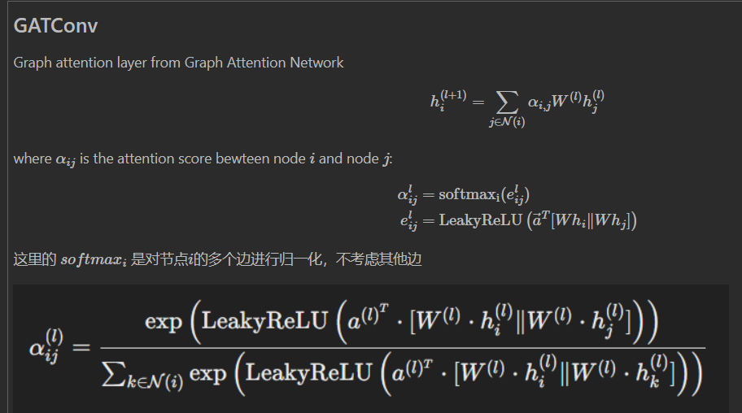
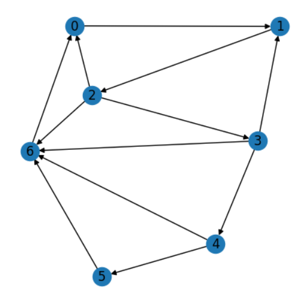
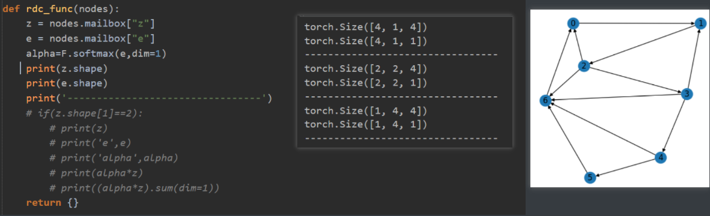
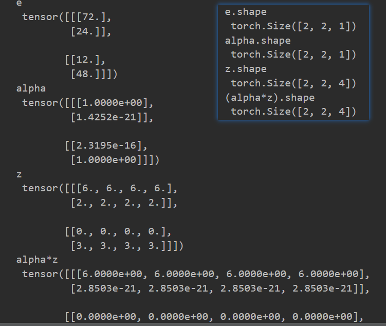
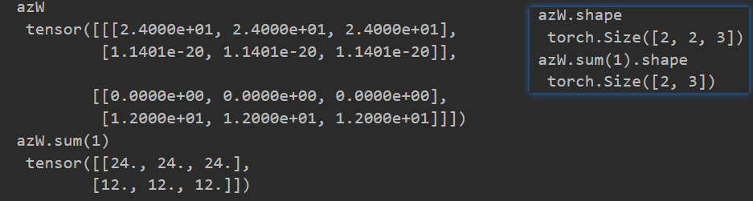
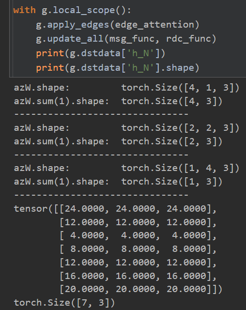
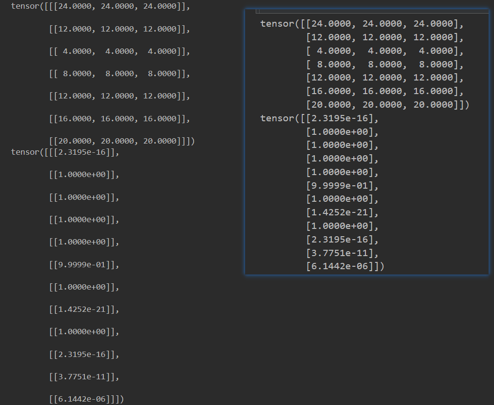

# DGL中的消息传递函数和聚合函数

探究mess_func和reduce_func内部过程

以实现GATConv为例

 

以下度均为入度：节点0、1有2个度，节点6有4个度，4个节点度为1

当图中节点的度各不相同时，

```python
def edge_attention(edges):
    hi = edges.dst["h"]  # 来自目的节点
    hj = edges.src["h"]  # 来自源节点
    hiW = hi @ W
    hjW = hj @ W
    h_cat = torch.cat([hiW, hjW], dim=1)  # 拼接
    e = F.leaky_relu(h_cat @ a)
    return {"e": e}  # 将e放在边上

def msg_func(edges):
    # 将边上的e传递给目的节点，将特征h从源节点传递给目的节点特征z
    return {"z": edges.src["h"], "e": edges.data["e"]}

def rdc_func(nodes):
    z = nodes.mailbox["z"]
    e = nodes.mailbox["e"]
    alpha=F.softmax(e,dim=1)
    # 在这里可以打印输出收集到的信息
    if(z.shape[1]==2):
        print(z)
        print('e',e)
        print('alpha',alpha)
        print(alpha*z)
        print((alpha*z).sum(dim=1))
    return {}

with g.local_scope():
    g.apply_edges(edge_attention)
    g.update_all(msg_func, rdc_func)
    print(g.dstdata['h_N'])
```



在聚合函数中打印从边传来的z和e，可以看到形式为（n，m，d），即度为m，维度为d的节点有n个，一共三种不同度的节点，因此会打印出3种。

 限制 if z.shape[1] == 2 ，只打印度为2的几个节点出来，得到



度为2的节点有**2个**，**每个节点**收到（2,4）向量z，收到（2,1）边信息e. 叠在一起就是（2,2,4）和（2,2,1）

这里的 $softmax_i$ 是对节点 $i$ 的多个边e进行归一化（dim=1）得到 $\alpha$，不考虑其他边，不是全局！因此e和 $\alpha$ 的shape都是（2,**2**,1）

对于**每个节点**，$\alpha$ (2,1) * z(2,4) ，使用了广播机制，即z的每一行都乘 $\alpha$ 对应行，因此 $\alpha$ *z的shape是（2,4）

让 $\alpha$ *z@W，得到



每个节点收到的 $\alpha$ \*z（2,4），整体就是（2,2,4），$\alpha$ \*zW 就是（2,4,3）
这里torch使用了广播机制，（2,2,4）@（4,3） =（2,4,3），相当于两个（2,4）@（4,3）=（2,3）再拼起来得到（2,2,3）

最后聚合，azW.sum(1)，表示**每个节点**收到的邻居信息之和，shape是（2,3），表示两个度为2的节点，聚合邻居信息之后得到（3,）的向量，叠在一起就是（2,3）了

假如我们去掉  if z.shape[1] == 2 这个只输出度为2的节点 的限制，那么打印结果如下，符合预期



然而得到某节点的attention，即$\alpha$有更加快捷的方式（我后来才知道）

```python
with g.local_scope():
    g.apply_edges(edge_attention)
    alpha=dgl.nn.functional.edge_softmax(g,g.edata['e'])
    g.update_all(msg_func, rdc_func)
    # print(g.dstdata['h_N'])
    # print(g.dstdata['h_N'].shape)
print(alpha)
```

这里的edge_softmax会自动将属于同一目的节点的边上的信息进行softmax，也就省去了在聚合函数里面的那一系列操作。



对比自己实现的GAT层和DGL内置的GAT层，输出结果以及注意力权重一样（W和a都初始化为1）

当然也可以在用edge_softmax得到attention值后，对边进行复制，然后使用内置的消息函数和求和函数

```python
W = torch.ones(4, 3)
a = torch.ones(6, 1)

from dgl.ops import edge_softmax

def edge_attention(edges):
    hi = edges.dst["h"]  # 来自目的节点
    hj = edges.src["h"]  # 来自源节点
    hiW = hi @ W
    hjW = hj @ W
    h_cat = torch.cat([hiW, hjW], dim=1)  # 拼接
    e = F.leaky_relu(h_cat @ a)
    return {"e": e}  # 将e放在边上

with g.local_scope():
    g.apply_edges(edge_attention)
    alpha = dgl.nn.functional.edge_softmax(g, g.edata["e"]) # edge_softmax
    g.edata["alpha"] = alpha # alpha即注意力权重

    g.ndata["hW"] = g.ndata["h"] @ W
    g.update_all(fn.u_mul_e("hW", "alpha", "m"), fn.sum("m", "hN")) # 内置函数
    hN = g.ndata["hN"]
    print(hN)
    print(alpha)
```

输出的结果与之前完全相同！！


