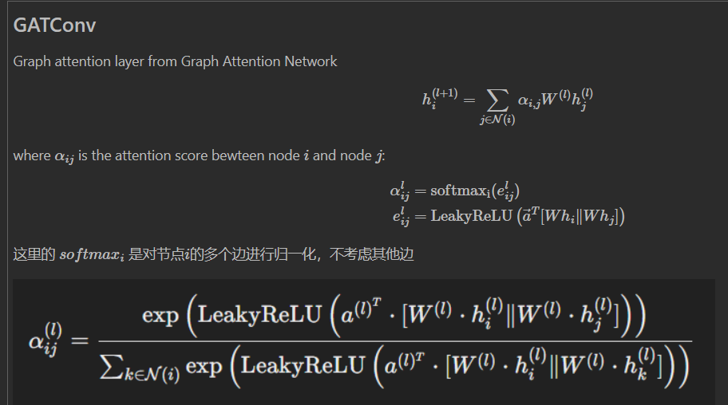
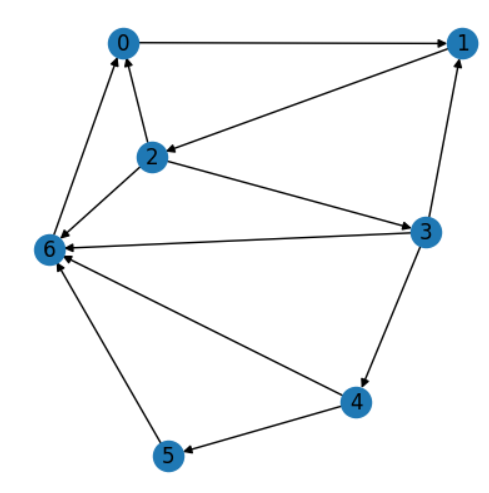

# DGL中的消息传递函数和聚合函数

以实现GATConv为例

 

以下度均为入度：节点0、1有2个度，节点6有4个度，4个节点度为1

当图中节点的度各不相同时，

```python
def edge_attention(edges):
    hi = edges.dst["h"] # 来自
    hj = edges.src["h"]
    hiW = hi @ W
    hjW = hj @ W
    h_cat = torch.cat([hiW, hjW], dim=1)
    e = F.leaky_relu(h_cat @ a)
    return {"e": e}

def msg_func(edges):
    return {"z": edges.src["h"], "e": edges.data["e"]}

def rdc_func(nodes):
    z = nodes.mailbox["z"]
    e = nodes.mailbox["e"]
    alpha=F.softmax(e,dim=1)
    if(z.shape[1]==2):
        print(z)
        print('e',e)
        print('alpha',alpha)
        print(alpha*z)
        print((alpha*z).sum(dim=1))
    return {}


with g.local_scope():
    g.apply_edges(edge_attention)
    g.update_all(msg_func, rdc_func)
```


在聚合函数中打印从边传来的z和e，可以看到形式为（n，m，d），即度为m，维度为d的节点有n个，一共三种不同度的节点，因此会打印出三。打印度为2的几个节点出来，得到


度为2的节点有两个，每个节点收到（2,4）向量z，收到（2,1）边信息e. 

这里的 $softmax_i$ 是对节点$i$的多个边进行归一化（dim=1）得到 $\alpha$，不考虑其他边。(alpha*z).sum(1)，即聚合，每个节点得到（2,1），整体看就是（1,2,1）


