# PYG中的消息传递和聚合函数

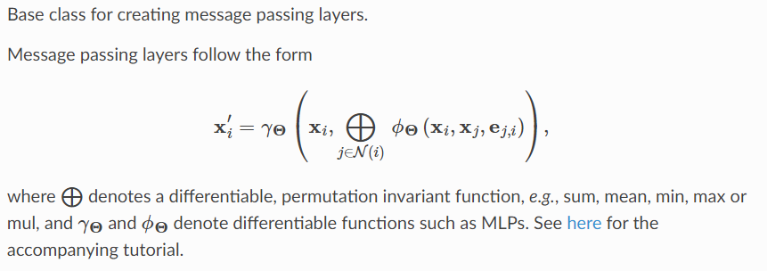

定义类

```python
class TestLayer(MessagePassing):
    ## 这个类需要继承MessagePassing，而MessagePassing已经继承了nn.Module
    def __init__(self, in_feats, out_feats):
        super(TestLayer, self).__init__(aggr="add")
        self.in_feats = in_feats
        self.out_feats = out_feats

        # Initialize learnable parameters
        self.weight = torch.nn.Parameter(torch.Tensor(in_feats, out_feats))
        self.att = torch.nn.Parameter(torch.Tensor(1, 2 * out_feats))

        self.reset_parameters()

    def reset_parameters(self):
        torch.nn.init.ones_(self.weight)
        torch.nn.init.ones_(self.att)

    ...
```

在 PyTorch Geometric 中，执行顺序通常如下：

1. **forward 方法**:
   - 当你调用 GNN 层时，会首先调用其 `forward` 方法。
   - 在 `forward` 方法中，你可以预处理输入数据，并调用 `propagate` 方法来执行消息传递和聚合。
2. **propagate 方法**:
   - `propagate` 方法实际上会调用 `message` 方法和 `aggregate` 方法。
   - `propagate` 方法负责将消息传递到图的所有节点，并根据聚合策略对消息进行聚合。
3. **message 方法**:
   - `message` 方法定义了每个边上的消息传递逻辑。
   - 在这个方法中，你可以根据边上的节点特征计算消息，并根据需要对消息进行处理。
4. **aggregate 方法**:
   - `aggregate` 方法定义了如何对节点接收到的消息进行聚合。
   - 在这个方法中，通常是对节点接收到的消息进行求和、求平均或者使用其他自定义的聚合策略。
5. **update 方法**:
   - 在一些情况下，`update` 方法也会被调用。但是，它通常是在消息传递和聚合后对节点进行最后的更新步骤。
   - 在这个方法中，你可以实现节点更新的逻辑，例如，通过简单地将聚合后的消息与节点的当前表示相加，或者通过一个神经网络来更新节点表示。

总的来说，执行顺序是从 `forward` 方法开始，然后是 `propagate` 方法，它会调用 `message` 和 `aggregate` 方法。`message` 方法定义了消息传递的逻辑，而 `aggregate` 方法定义了对消息的聚合方式。在一些情况下，`update` 方法也会被调用来对节点进行最后的更新。

以上为ChatGPT说的，验证一下


定义图

```python
edge_index = torch.LongTensor(
    [
        [0, 0, 1, 2, 4, 4, 4, 5],
        [1, 2, 2, 3, 0, 2, 3, 1],
    ]
)
feat = torch.FloatTensor(
    [
        [0, 0, 0, 0],
        [1, 1, 1, 1],
        [2, 2, 2, 2],
        [3, 3, 3, 3],
        [4, 4, 4, 4],
        [5, 5, 5, 5],
    ]
)
data = Data(x=feat, edge_index=edge_index)
edge_attr = torch.ones(data.num_edges)
data.edge_attr = edge_attr
```

在类中定义message和forward

```python
    def forward(self, data):
        x = data.x
        edge_attr = data.edge_attr
        edge_index = data.edge_index
        hw = x @ self.weight
        print("in forward")
        print("x\n", x)
        print("hw\n", hw)
        print("----------------------------------")
        self.propagate(edge_index=edge_index, x=x, hw=hw)

    def message(self, x, x_j, x_i, hw, hw_i, hw_j):
        print("in message")
        print("x\n", x)
        print("x_i\n", x_i)
        print("x_j\n", x_j)
        print('in message')
        print("hw\n", hw)
        print("hw_i\n", hw_i)
        print("hw_j\n", hw_j)
        print("----------------------------------")
        return hw_i + hw_j
```

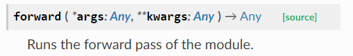

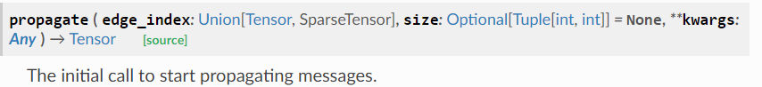

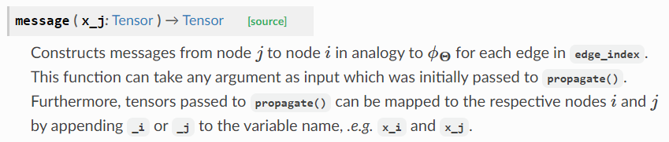

forward的输入是任意的，和pytorch一样。这里x是输入，hw是经过线性变换。

propagate必须的输入参数为edge_index，其他随便，但是message定义形参需要有变量来接。比如这里还传入了x和hw，那么message定义时形参可以有{ x, x_i, x_j, hw, hw_i, hw_j }，加上 _i 或 _j 来表示dst或src。

输出如下

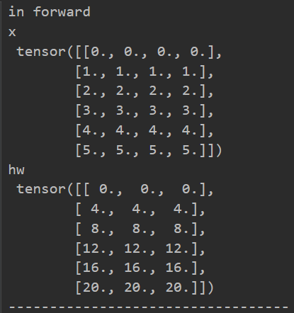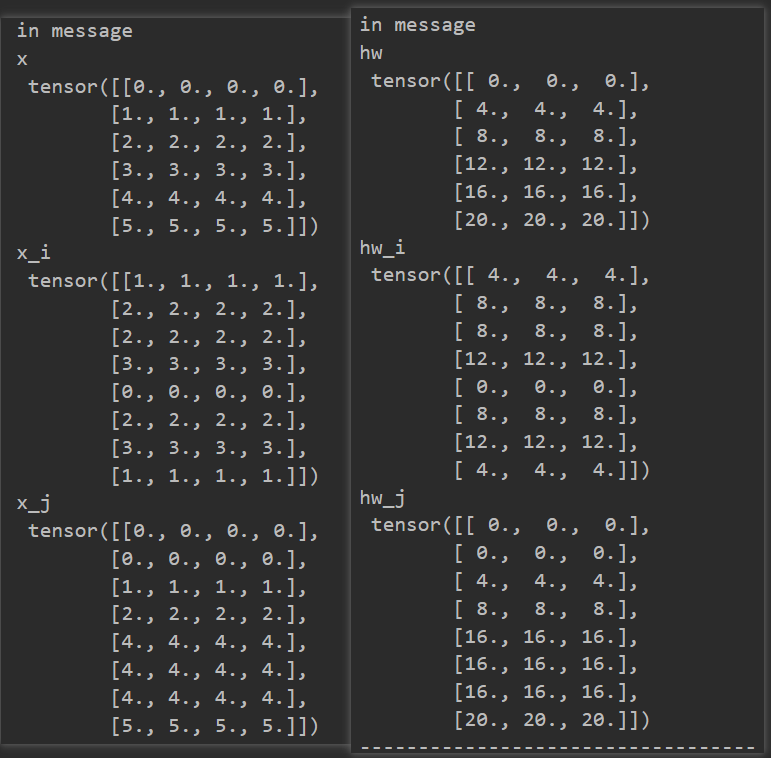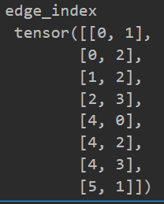

在message中的打印信息，x_i是目的节点，x_j是邻居（源节点），它们对应edge_index。一共有8条边，源节点是[0,0,1,2,4,4,4,5]，与x_j对应，目的节点是[1,2,2,3,0,2,3,1]，与x_i对应。message的return会传入aggregate

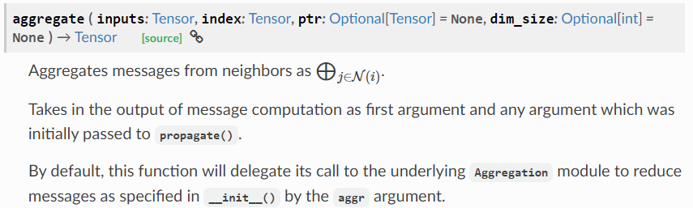

如果不重写aggregate的话，message将把调用委托给底层reduce模块，即在**init**() 中由 aggr 参数指定的方法如‘add’，此时message的返回值的样本数（行），必须与edge_index的shape[0]相同，也就是边数相同，否则报错RuntimeError: The expanded size of the tensor (6) must match the existing size (8) at non-singleton dimension 0. Target sizes: [6, 3]. Tensor sizes: [8, 1]

message返回值是aggreate的第一个参数，以及最初传递给 propagate() 的**所有**参数，本例子就是edge_index, x, hw。

```python
    def aggregate(self, ijsum,x, edge_index, hw, sb):
        print("in aggregate")
        print('hw_i+hw_j\n',ijsum)
        # print('x\n',x)
        # print('edge_index\n',edge_index)
        # print('hw\n',hw)
        print("----------------------------------")
        return  ijsum
```

输出如图

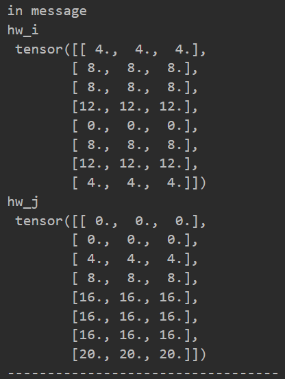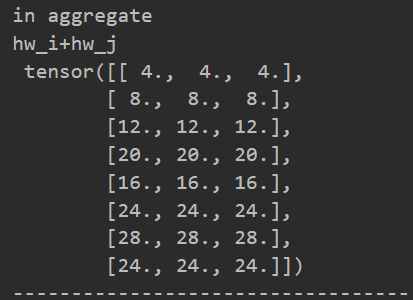

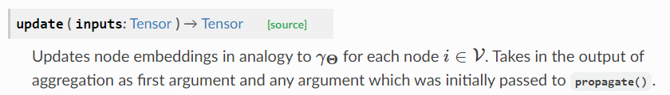

类初始化时，\_\_init\_\_(aggr='add')选择**自带聚合器**。这里分为以下几种情况

1. 如果类中没重写message，那么forward中的self.propagate中的x，将传入**自带聚合器**进行聚合；

2. 如果类中重写了message，没重写aggregate，那么aggregate的返回值传入**自带聚合器**进行聚合；

3. 如果重写了aggregate没重写update，那么aggregate返回值直接传给forward中的self.propagate；

4. 如果重写了update，那么aggregate的返回值传给update，进行自定义处理方式后，update返回值进而传给forward中的self.propagate。

如下图所示。


aggregate返回值是update的第一个参数，以及最初传递给 propagate() 的**所有**参数，本例子就是edge_index, x, hw。并且aggregate也可以在参数后加上 _i 或 _j 来表示dst或src。本例子中，aggregate将hwi+hwj传给了update。

如果要自定义实现聚合函数，那就要用到torch_scatter.scatter

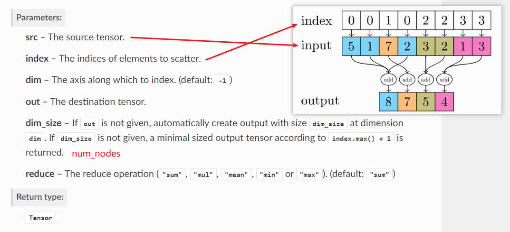

```python
    def update(self, ijsum, edge_index, num_nodes):
        # print("in update")
        # print("hw_i+hw_j\n", ijsum)
        h = scatter(
            src=ijsum, index=edge_index[1], dim=0, reduce="sum", dim_size=num_nodes
        )
        # print("h\n", h)
        e=data.edge_attr
        # print('e\n',e)
        alpha= edge_softmax(e,edge_index[1],num_nodes=num_nodes)
        # print('alpha\n',alpha)
        # print("----------------------------------")
        return h
```

scatter中，dim=0因为特征是行向量，dim_size=num_nodes，因为有些节点并没有输入。这里让hwi+hwj顺着边进行聚合得到h，然后返回给forward中的self.propagate

这里还使用了torch_geometric.utils.softmax (as edge_softmax)，来对指向同一dst的边进行softmax，类似GAT的一个步骤。

打印输出如下

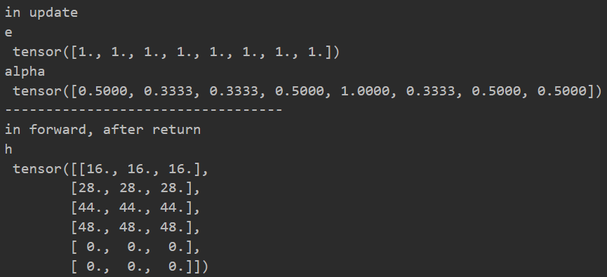

```python
    def forward(self, edge_index, x, edge_attr, get_attention=False):
        edge_index, edge_attr = remove_self_loops(edge_index, edge_attr)
        edge_index, edge_attr = add_self_loops(
            edge_index, edge_attr, fill_value="mean", num_nodes=x.shape[0]
        )

        edge_attr = edge_attr.view(-1, self.edge_dim)
        wx = x @ self.w_node
        we = edge_attr @ self.w_edge
        alpha = self.edge_updater(edge_index, wx=wx, we=we)

        out = self.propagate(edge_index, wx=wx, alpha=alpha)

        if get_attention:
            return out, alpha
        else:
            return out

    def edge_update(self, wx_i, wx_j, we, edge_index):
        wx_iatt = wx_i @ self.att_self
        wx_jatt = wx_j @ self.att_neih
        weatt = we @ self.att_edge

        e = wx_iatt + wx_jatt + weatt
        e = F.leaky_relu(e)

        alpha = edge_softmax(e, edge_index[1])
        return alpha
```

这里展示了GAT层的部分代码，forward中调用了edge_updater函数，edge_updater会将参数传给需要我们重写的edge_update函数。edge_updater与propagate类似，会将参数x拆分为x_i和x_j

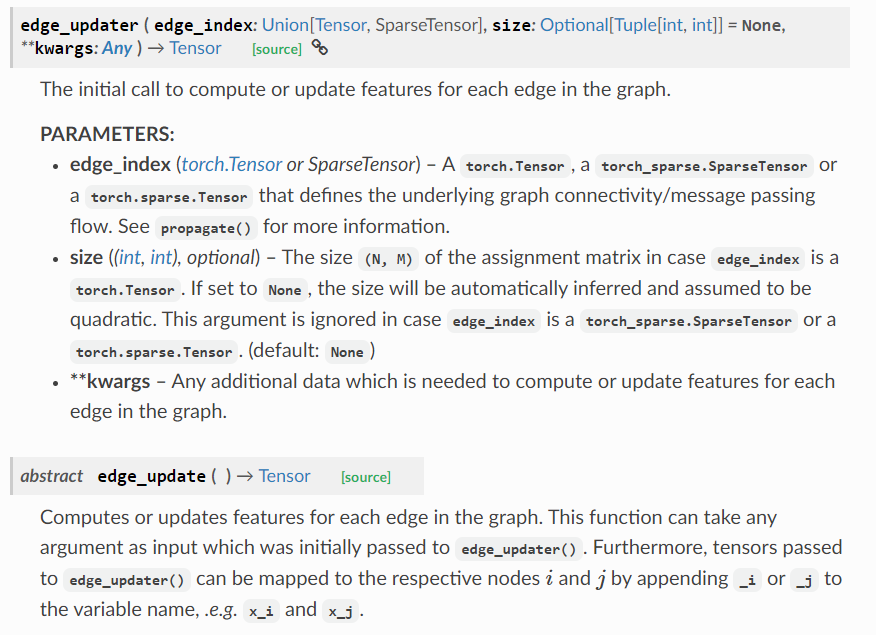
