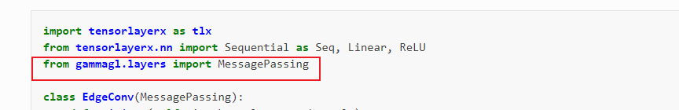
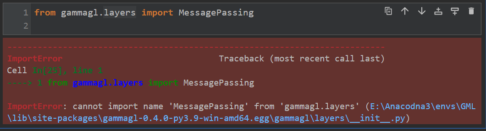
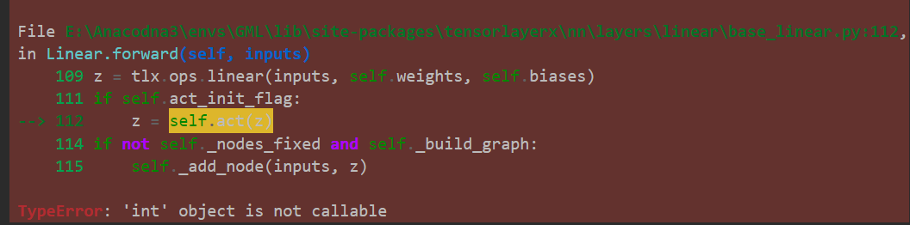

### 1



上述代码来自gammagl的docs



MessagePassing应该在gammagl.layers.conv下，这个...egg\gammagl\layers\\_\_init\_\_.py 是空的，github对应文件也是空的

（源码中也是  from gammagl.layers.conv import MessagePassing ）

### 2（已解决）

```python
lin=tlx.layers.Linear(4,3)
x = tlx.eye(3)
lin(x)
```



这个tensorlayerx是按照gammagl上教程安装的，这个Linear无法正常使用的样子，但是GCNConv却可以跑通。然而GCNConv源码里用到了这个tlx.layers.Linear，

~~mlgb~~，这个Linear是(out_channels,in_channels,...)，和torch相反！

但是通过pip安装gammagl和tensorlayerx会检测不到我的torch，默认backend是tensorflow

请问到时候在gammagl上实现模型是在自己电脑上实现，还是远程连接学校的服务器？

### 3

openhgnn的网上教程那里

```python
from openhgnn import Experiment
```

源码中用到了networkx中某个函数叫edge_betweenness，但是networkx各个版本都没有这个函数，只有 edge_betweenness_centrality，改了源码后倒是可以跑得动。

不过我打算在openhgnn上实现模型，所以没细看openhgnn
